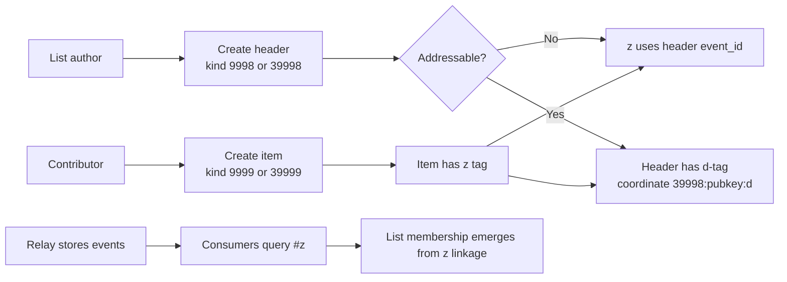
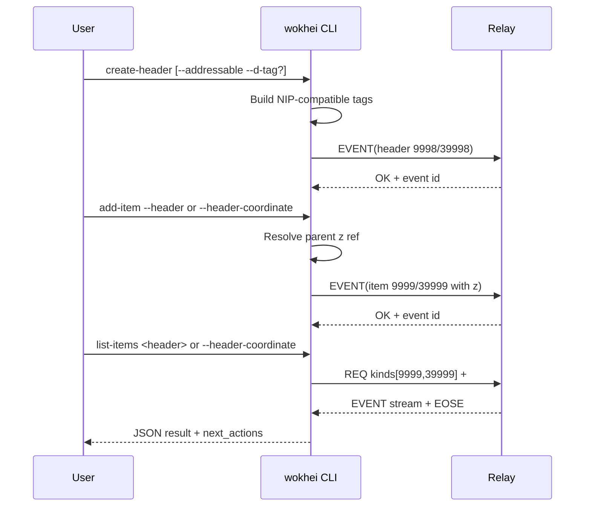

# Protocol

This document defines the protocol baseline for Wokhei and explains how the implementation follows it.

## Standards in Scope

1. **NIP-01 (Basic protocol flow)**
   - Source: https://raw.githubusercontent.com/nostr-protocol/nips/master/01.md
2. **Decentralized Lists custom NIP** (the NostrHub reference provided in this repo context)
   - NostrHub naddr: https://nostrhub.io/naddr1qvzqqqrcvypzpef89h53f0fsza2ugwdc3e54nfpun5nxfqclpy79r6w8nxsk5yp0qy2hwumn8ghj7un9d3shjtnyd968gmewwp6kyqqnv3jkxetww3exzmrf0fjkgttvd9ehgucxgd7rv
   - Source mirror used by this project: https://raw.githubusercontent.com/wds4/brainstorm-knowledge-graph/main/docs/nips/decentralizedLists.md

---

## 1) NIP-01 Requirements Used by Wokhei

Wokhei relies on NIP-01 foundations:

- **Event model**: events have `id`, `pubkey`, `created_at`, `kind`, `tags`, `content`, `sig`.
- **Cryptographic signing**: event signing follows the Nostr event model through `nostr-sdk`.
- **Kind semantics**:
  - Regular events: used here for `9998` (header) and `9999` (item)
  - Addressable events: used here for `39998` (header) and `39999` (item), keyed by `(kind, pubkey, d-tag)`
- **Relay protocol**: WebSocket publish/query behavior is handled through `nostr-sdk` client operations (`send_event_builder`, `fetch_events`) which map to NIP-01 EVENT/REQ flows.
- **Tag conventions**: Wokhei uses NIP-01-compatible tag arrays and coordinate forms (notably `a`-style coordinate format in `z` for addressable parents: `39998:<pubkey>:<d-tag>`).

---

## 2) Decentralized Lists Requirements Used by Wokhei

From the Decentralized Lists spec:

- **Header declarations** use kind `9998` or `39998`.
- **Item declarations** use kind `9999` or `39999`.
- Header must include `names` (singular + plural).
- Addressable header (`39998`) must include `d`.
- Items must include `z` pointing to the parent list:
  - `z=<header-event-id>` for regular header (`9998`)
  - `z=39998:<pubkey>:<d-tag>` for addressable header (`39998`)
- Addressable items (`39999`) must include `d`.

---

## 3) How Wokhei Implements These Standards

### Header creation

`wokhei create-header` maps directly to list-header declarations:

- Chooses kind `9998` or `39998` via `--addressable`
- Requires `--d-tag` when addressable
- Emits protocol tags including `names`, optional `titles`, `description`, `required`, `recommended`, topic tags (`t`), `alt`, and `client`
- Returns `coordinate` for addressable headers so follow-up item commands can use stable parent addressing

Implementation references:
- `src/header.rs`
- `src/main.rs` (`create-header` command surface)

### Item creation

`wokhei add-item` maps directly to list-item declarations:

- Chooses kind `9999` or `39999` via `--addressable`
- Requires `--d-tag` when item is addressable (`39999`)
- Always derives and emits `z` parent pointer automatically
- Supports parent resolution by either:
  - `--header=<event-id>`
  - `--header-coordinate=39998:<pubkey>:<d-tag>`
- Emits `r` resource tag and optional custom field tags (`key=value` -> custom tag)

Implementation references:
- `src/item.rs`
- `src/main.rs` (`add-item` command surface)

### Coordinate and parent-pointer correctness

Wokhei normalizes and validates coordinates to prevent malformed parent references:

- Validates `kind:pubkey:d-tag` format
- Enforces `39998` for coordinate mode
- Canonicalizes coordinate output to `39998:<normalized-pubkey>:<d-tag>`
- Uses the resolved parent reference as the `z` tag value for item retrieval and linking

Implementation references:
- `src/item.rs` (`parse_coordinate_str`, `resolve_header_ref`)
- `src/query.rs` (`normalize_coordinate_ref`, `z_ref_for_header_event`)

### Query behavior for list membership

`wokhei list-items` follows the spec by fetching item events through `z` linkage:

- Queries only kinds `9999` and `39999`
- Filters by `#z=<parent-ref>` so membership is derived from the protocol-defined parent pointer

Implementation reference:
- `src/query.rs` (`fetch_items_by_z`)

### Raw protocol publishing

`wokhei publish` supports direct raw event publishing from JSON while still using signed relay publication flow.

Implementation reference:
- `src/publish.rs`

---

## 4) Mermaid Diagrams

### A. Decentralized Lists data model and lifecycle

### B. How Wokhei executes protocol flow

---

## 5) Practical Protocol Contract for Wokhei Users

When using Wokhei, treat these as hard rules:

1. Use `39998/39999` + `d-tag` when you need updatable identity.
2. Use `9998/9999` for immutable event-id-based records.
3. For all item events, `z` is the parent link of record.
4. Prefer coordinate parents (`39998:<pubkey>:<d-tag>`) when cross-relay or long-lived references matter.
5. Keep downstream tooling keyed by the same protocol primitives (`kind`, `pubkey`, `d`, `z`).
